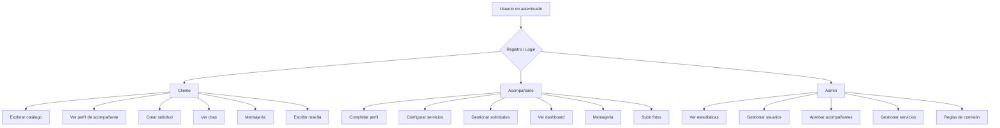
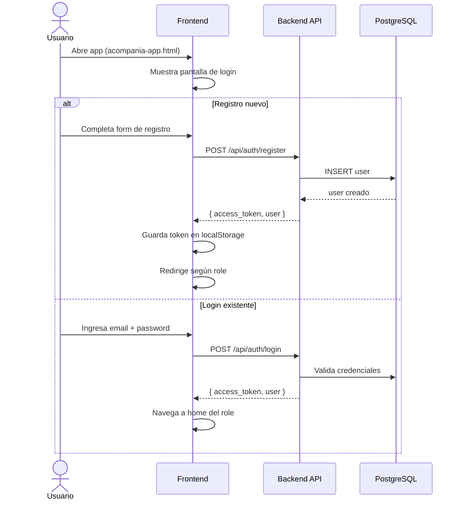
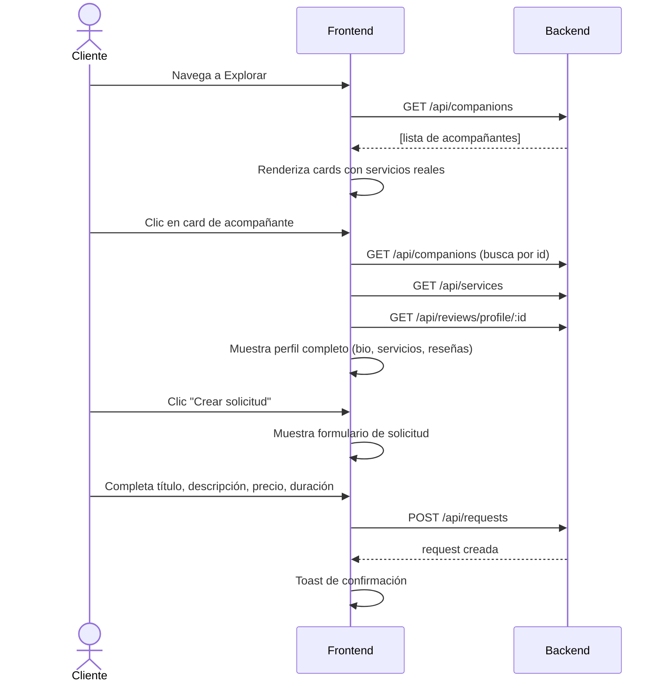
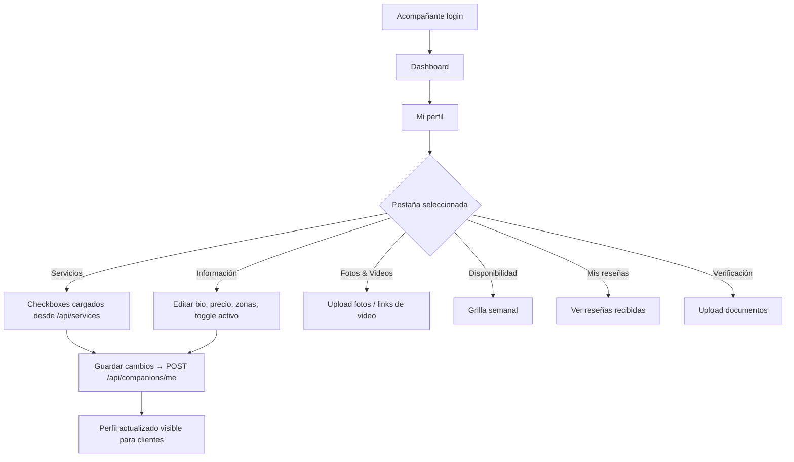
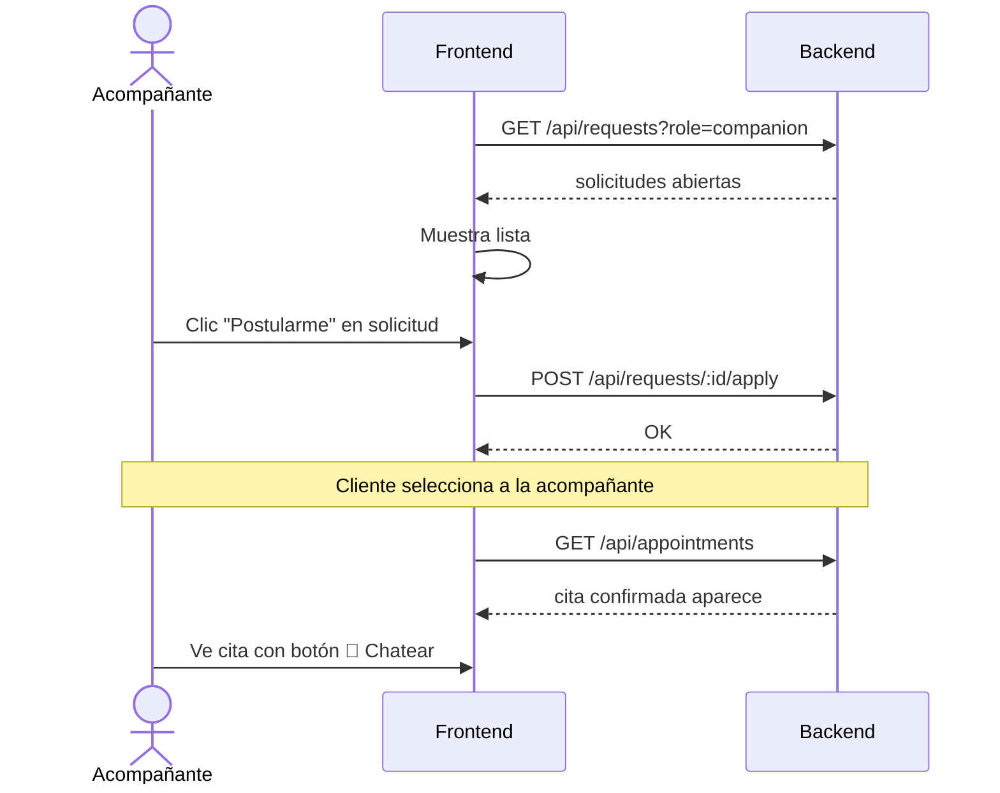
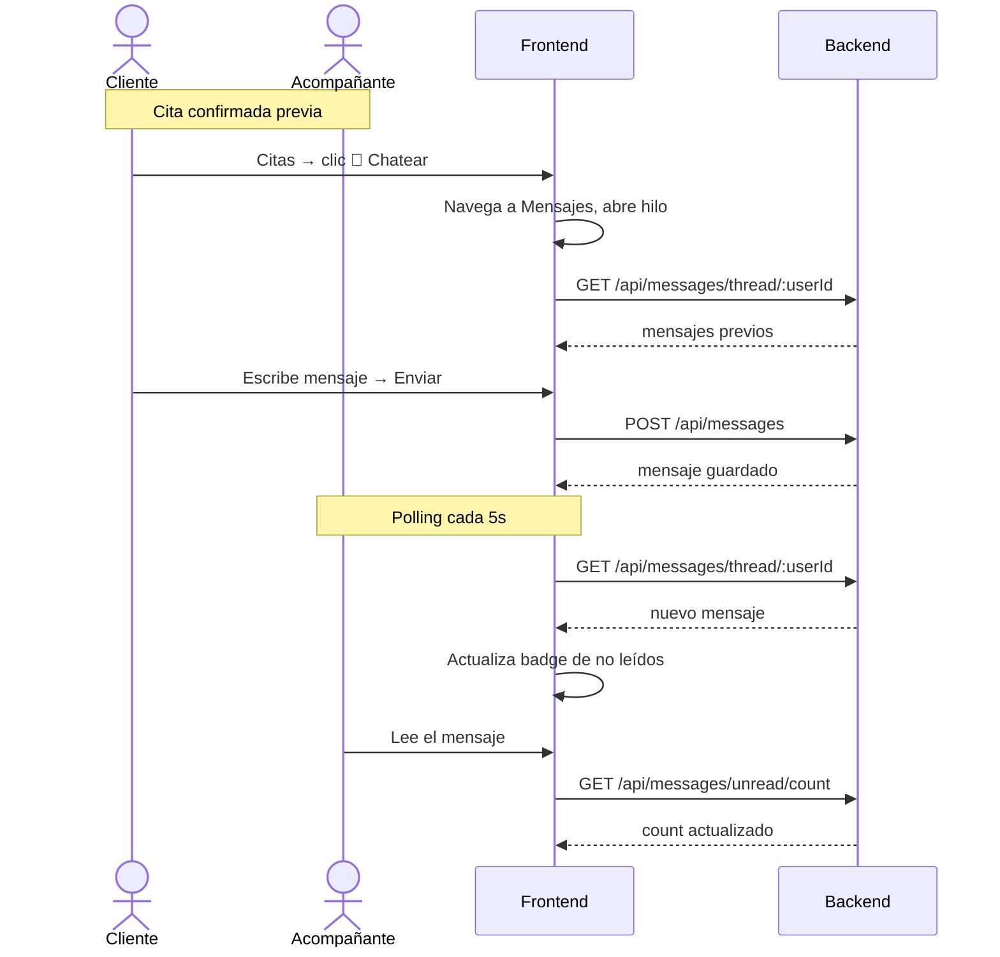
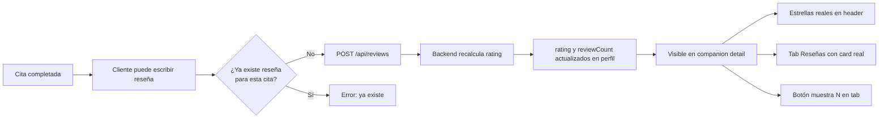
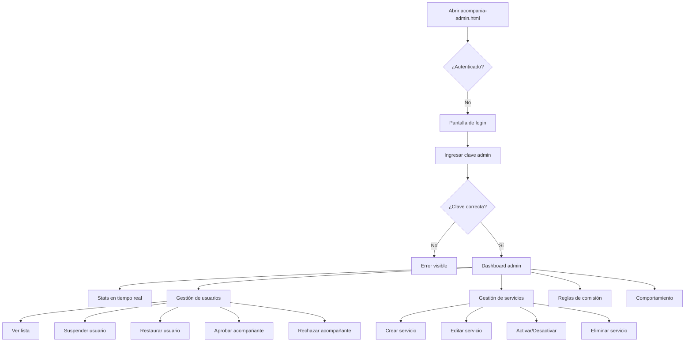

# Set de Pruebas — Release 0
> Acompañía Platform · `acompania-app.html` + `acompania-admin.html` + Railway backend

---

## Índice
1. [Arquitectura y ambiente](#1-arquitectura-y-ambiente)
2. [Cobertura de flujos](#2-cobertura-de-flujos)
3. [T-AUTH — Autenticación](#t-auth--autenticación)
4. [T-CLIENT — Flujos del cliente](#t-client--flujos-del-cliente)
5. [T-COMP — Flujos de la acompañante](#t-comp--flujos-de-la-acompañante)
6. [T-MSG — Mensajería](#t-msg--mensajería)
7. [T-REV — Reseñas y calificaciones](#t-rev--reseñas-y-calificaciones)
8. [T-ADMIN — Panel de administración](#t-admin--panel-de-administración)
9. [T-API — Pruebas de API directas](#t-api--pruebas-de-api-directas)
10. [Criterios de aceptación](#10-criterios-de-aceptación)

---

## 1. Arquitectura y ambiente

| Componente | URL | Tecnología |
|---|---|---|
| Frontend | `https://<vercel-domain>` | HTML estático (Vercel) |
| Backend API | `https://acompania-backend-production.up.railway.app` | NestJS + Prisma (Railway) |
| Base de datos | Railway PostgreSQL | PostgreSQL |
| Admin panel | `acompania-admin.html` | HTML estático |

**Variables de entorno necesarias para pruebas:**
```
API_BASE = https://acompania-backend-production.up.railway.app
ADMIN_KEY = Campeado.1409!
TEST_CLIENT_EMAIL = testclient@test.com
TEST_CLIENT_PW = Test1234!
TEST_COMP_EMAIL = testcomp@test.com
TEST_COMP_PW = Test1234!
```

---

## 2. Cobertura de flujos



---

## T-AUTH — Autenticación

### Diagrama de flujo



### Casos de prueba

| ID | Nombre | Pasos | Resultado esperado |
|---|---|---|---|
| AUTH-01 | Registro cliente exitoso | 1. Abrir app → Crear cuenta → Rol: Cliente → Completar form → Enviar | Sesión iniciada, redirige a home del cliente |
| AUTH-02 | Registro acompañante exitoso | 1. Abrir app → Crear cuenta → Rol: Acompañante → Completar form → Enviar | Sesión iniciada, redirige a dashboard de acompañante |
| AUTH-03 | Login cliente exitoso | 1. Email + PW correctos → Ingresar | Token guardado en localStorage, vista de cliente |
| AUTH-04 | Login acompañante exitoso | 1. Email + PW correctos → Ingresar | Token guardado en localStorage, vista de acompañante |
| AUTH-05 | Login con credenciales incorrectas | 1. PW incorrecta → Ingresar | Toast de error "Credenciales incorrectas", no navega |
| AUTH-06 | Persistencia de sesión | 1. Login → Cerrar tab → Reabrir URL | Sesión restaurada desde localStorage |
| AUTH-07 | Logout | 1. Cerrar sesión desde el menú | Token eliminado, vuelve a pantalla de login |
| AUTH-08 | Email duplicado | 1. Registrar email ya existente | Error indicando email en uso |

---

## T-CLIENT — Flujos del cliente

### Diagrama: Crear solicitud



### Casos de prueba

| ID | Nombre | Pasos | Resultado esperado |
|---|---|---|---|
| CLI-01 | Ver catálogo de acompañantes | 1. Login cliente → Explorar | Grid con cards; tags = servicios reales del backend |
| CLI-02 | Filtro por servicio | 1. Explorar → Seleccionar servicio del dropdown | Dropdown cargado dinámicamente desde `/api/services` |
| CLI-03 | Ver perfil de acompañante | 1. Clic en card de acompañante | Nombre, bio, precio, servicios y reseñas reales (no dummy) |
| CLI-04 | Servicios reales en perfil | 1. Perfil → Tab "Servicios" | Solo muestra servicios que la acompañante configuró |
| CLI-05 | Reseñas reales en perfil | 1. Perfil → Tab "Reseñas" | Reseñas reales o mensaje "Sin reseñas aún" |
| CLI-06 | Calificación real | 1. Ver perfil → rating visible en header | Número calculado por el backend, no hardcodeado |
| CLI-07 | Crear solicitud | 1. Perfil acompañante → Crear solicitud → Completar form → Enviar | Toast de éxito, aparece en "Mis solicitudes" |
| CLI-08 | Ver solicitudes | 1. Mis solicitudes | Lista las solicitudes con estado actual |
| CLI-09 | Cancelar solicitud pendiente | 1. Solicitud pendiente → Cancelar | Solicitud eliminada de la lista |
| CLI-10 | Seleccionar acompañante para solicitud | 1. Solicitud con postulantes → Botón "Seleccionar" | Modal de confirmación aparece (no error de JSON) |
| CLI-11 | Ver citas | 1. Citas | Lista citas con estado (pendiente, confirmada, completada) |

---

## T-COMP — Flujos de la acompañante

### Diagrama: Gestión de perfil y servicios



### Diagrama: Gestión de solicitudes



### Casos de prueba

| ID | Nombre | Pasos | Resultado esperado |
|---|---|---|---|
| COMP-01 | Ver dashboard | 1. Login acompañante → Dashboard | Stats: solicitudes activas, citas próximas, rating |
| COMP-02 | Editar información de perfil | 1. Mi perfil → Información → Editar bio, precio → Guardar | Toast "Perfil guardado", datos persisten al volver |
| COMP-03 | Tab Servicios reset | 1. Mi perfil → clic "Servicios" → navegar a otro menú → volver a Mi perfil | Siempre abre en tab "Información", no en Servicios |
| COMP-04 | Cargar servicios del admin | 1. Mi perfil → Tab Servicios | Checkboxes con servicios creados en el admin panel |
| COMP-05 | Seleccionar y guardar servicios | 1. Marcar 3 servicios → Guardar → Ver perfil público | Los 3 servicios aparecen en la vista de cliente |
| COMP-06 | Servicios pre-seleccionados | 1. Guardar servicios → Salir → Volver a tab Servicios | Los servicios guardados aparecen pre-marcados |
| COMP-07 | Subir foto de perfil | 1. Mi perfil → Cambiar foto → Seleccionar imagen | Avatar actualizado, visible en todas las vistas |
| COMP-08 | Ver solicitudes abiertas | 1. Solicitudes | Lista de solicitudes de clientes a las que puede postular |
| COMP-09 | Postular a solicitud | 1. Solicitud → "Postularme" | Aparece como postulante, cliente puede seleccionarla |
| COMP-10 | Ver cita confirmada | 1. Citas | Aparece cita con datos del cliente y botón Chatear |

---

## T-MSG — Mensajería

### Diagrama de flujo



### Casos de prueba

| ID | Nombre | Pasos | Resultado esperado |
|---|---|---|---|
| MSG-01 | Iniciar chat desde cita | 1. Citas → cita confirmada → 💬 Chatear | Abre Mensajes con el hilo ya abierto |
| MSG-02 | Enviar mensaje como cliente | 1. Mensajes → hilo → escribir → Enviar | Mensaje aparece en burbuja derecha |
| MSG-03 | Recibir mensaje (polling) | 1. Acompañante envía mensaje | En ≤ 5s aparece el mensaje en el hilo del cliente |
| MSG-04 | Badge de no leídos | 1. Acompañante envía mensaje → cliente no ha abierto Mensajes | Badge con número aparece en ítem de nav "Mensajes" |
| MSG-05 | Badge se limpia | 1. Cliente abre hilo con mensajes no leídos | Badge desaparece |
| MSG-06 | Lista de conversaciones | 1. Mensajes → panel izquierdo | Muestra todas las conversaciones con nombre y último mensaje |
| MSG-07 | Chat bidireccional | 1. Cliente envía mensaje → acompañante responde | Ambos mensajes visibles en el hilo, cada uno en su lado |

---

## T-REV — Reseñas y calificaciones

### Diagrama de flujo



### Casos de prueba

| ID | Nombre | Pasos | Resultado esperado |
|---|---|---|---|
| REV-01 | Ver reseñas reales | 1. Explorar → Ver perfil → Tab Reseñas | Reseñas del backend o "Sin reseñas aún" (no dummy) |
| REV-02 | Rating real en header | 1. Ver perfil de acompañante | Número calculado por backend, no 4.9 hardcodeado |
| REV-03 | Contador en tab | 1. Ver perfil → Tab Reseñas | Botón dice "Reseñas (N)" con el N real |
| REV-04 | Crear reseña | 1. Cita completada → Escribir reseña → Enviar | Toast de éxito, reseña aparece en perfil |
| REV-05 | Rating se actualiza | 1. Crear reseña con rating 5 → Ver perfil | Rating recalculado en el header |
| REV-06 | Reseña duplicada bloqueada | 1. Intentar crear segunda reseña para misma cita | Error del backend, no se duplica |

---

## T-ADMIN — Panel de administración

### Diagrama de flujo



### Casos de prueba

| ID | Nombre | Pasos | Resultado esperado |
|---|---|---|---|
| ADM-01 | Login admin correcto | 1. Abrir admin.html → PW: `Campeado.1409!` | Accede al dashboard |
| ADM-02 | Login admin incorrecto | 1. PW incorrecta → Ingresar | Error visible, no accede |
| ADM-03 | Cambiar clave admin | 1. Configuración → Nueva clave → Guardar → Cerrar sesión → Login con nueva clave | Accede con la nueva clave |
| ADM-04 | Stats del dashboard | 1. Dashboard → ver métricas | Usuarios totales, activos, pendientes, solicitudes hoy — datos reales del backend |
| ADM-05 | Ver lista de usuarios | 1. Usuarios → tabla | Lista usuarios registrados con email, rol, estado |
| ADM-06 | Suspender usuario | 1. Usuarios → usuario activo → Suspender | Estado cambia a Suspendido |
| ADM-07 | Restaurar usuario | 1. Usuarios → usuario suspendido → Restaurar | Estado cambia a Activo |
| ADM-08 | Aprobar acompañante | 1. Usuarios → acompañante pendiente → Aprobar | Profile `isApproved: true`, visible en catálogo |
| ADM-09 | Rechazar acompañante | 1. Usuarios → acompañante → Rechazar | Profile `isApproved: false` |
| ADM-10 | Crear servicio | 1. Servicios → + Nuevo servicio → Nombre, categoría → Guardar | Servicio aparece en la tabla y en `/api/services` |
| ADM-11 | Servicio disponible para acompañantes | 1. Crear servicio → Login acompañante → Mi perfil → Servicios | Nuevo servicio aparece como checkbox |
| ADM-12 | Desactivar servicio | 1. Servicios → Toggle activo/inactivo | Servicio desaparece de `/api/services` (solo activos son públicos) |
| ADM-13 | Eliminar servicio | 1. Servicios → Eliminar | Servicio eliminado de tabla y de los perfiles de acompañantes |
| ADM-14 | Regla de comisión | 1. Comisiones → + Nueva regla → Porcentaje/fijo → Guardar | Regla aparece en la tabla (localStorage) |

---

## T-API — Pruebas de API directas

> Estas pruebas se ejecutan via `curl` y pueden ser lanzadas automáticamente. Reemplaza `$TOKEN` con el access_token de un usuario autenticado y `$COMP_PROFILE_ID` con el ID de un perfil de acompañante.

### Autenticación
```bash
# API-01: Login
curl -s -X POST https://acompania-backend-production.up.railway.app/api/auth/login \
  -H "Content-Type: application/json" \
  -d '{"email":"testclient@test.com","password":"Test1234!"}' | python3 -m json.tool

# API-02: Registro
curl -s -X POST https://acompania-backend-production.up.railway.app/api/auth/register \
  -H "Content-Type: application/json" \
  -d '{"email":"newuser@test.com","password":"Test1234!","role":"CLIENTE"}' | python3 -m json.tool
```

### Companions
```bash
# API-03: Listar acompañantes (público)
curl -s https://acompania-backend-production.up.railway.app/api/companions | python3 -m json.tool

# API-04: Perfil propio (requiere auth)
curl -s https://acompania-backend-production.up.railway.app/api/companions/me \
  -H "Authorization: Bearer $TOKEN" | python3 -m json.tool
```

### Servicios
```bash
# API-05: Listar servicios activos (público)
curl -s https://acompania-backend-production.up.railway.app/api/services | python3 -m json.tool

# API-06: Crear servicio (admin)
curl -s -X POST https://acompania-backend-production.up.railway.app/api/admin/services \
  -H "Content-Type: application/json" \
  -H "x-admin-key: Campeado.1409!" \
  -d '{"name":"Test Servicio","category":"Test","isActive":true}' | python3 -m json.tool

# API-07: Listar servicios admin (incluye inactivos)
curl -s https://acompania-backend-production.up.railway.app/api/admin/services \
  -H "x-admin-key: Campeado.1409!" | python3 -m json.tool
```

### Solicitudes y citas
```bash
# API-08: Crear solicitud (requiere auth cliente)
curl -s -X POST https://acompania-backend-production.up.railway.app/api/requests \
  -H "Content-Type: application/json" \
  -H "Authorization: Bearer $TOKEN" \
  -d '{"title":"Cena de negocios","description":"Evento formal","pricePerHour":30000,"durationHours":3}' | python3 -m json.tool

# API-09: Listar solicitudes del cliente
curl -s https://acompania-backend-production.up.railway.app/api/requests \
  -H "Authorization: Bearer $TOKEN" | python3 -m json.tool
```

### Admin
```bash
# API-10: Stats del admin
curl -s https://acompania-backend-production.up.railway.app/api/admin/stats \
  -H "x-admin-key: Campeado.1409!" | python3 -m json.tool

# API-11: Listar todos los usuarios
curl -s https://acompania-backend-production.up.railway.app/api/admin/users \
  -H "x-admin-key: Campeado.1409!" | python3 -m json.tool

# API-12: Admin sin clave (debe fallar 401)
curl -s https://acompania-backend-production.up.railway.app/api/admin/stats | python3 -m json.tool
```

### Reviews
```bash
# API-13: Reseñas de un perfil (público)
curl -s https://acompania-backend-production.up.railway.app/api/reviews/profile/$COMP_PROFILE_ID | python3 -m json.tool
```

### Mensajes
```bash
# API-14: Conteo de no leídos (requiere auth)
curl -s https://acompania-backend-production.up.railway.app/api/messages/unread/count \
  -H "Authorization: Bearer $TOKEN" | python3 -m json.tool
```

---

## 10. Criterios de aceptación

Para considerar **Release 0 como PASS** se deben cumplir:

| Categoría | Mínimo requerido |
|---|---|
| T-AUTH | AUTH-01 a AUTH-07 sin errores |
| T-CLIENT | CLI-01 a CLI-08 sin errores |
| T-COMP | COMP-01 a COMP-06 sin errores |
| T-MSG | MSG-01, MSG-02, MSG-04 sin errores |
| T-REV | REV-01, REV-02 sin errores |
| T-ADMIN | ADM-01, ADM-04, ADM-05, ADM-10, ADM-11 sin errores |
| T-API | API-01, API-03, API-05, API-10, API-12 sin errores |
| **Regresión bloqueante** | Sin datos hardcoded en UI (servicios, reseñas, rating) |

### Definición de FAIL
- Datos dummy visibles en producción (nombres, reseñas, servicios hardcoded)
- Error de JS no capturado que rompe la navegación
- Endpoint de admin accesible sin `x-admin-key`
- Pérdida de sesión sin acción del usuario
- Tab de perfil no resetea al volver (bug de estado de UI)

---

*Documento generado para Release 0 · Acompañía Platform*
*Para ejecutar: pedir "ejecuta Set de pruebas Release 0" o un subconjunto como "ejecuta T-API" o "ejecuta ADM-10"*
